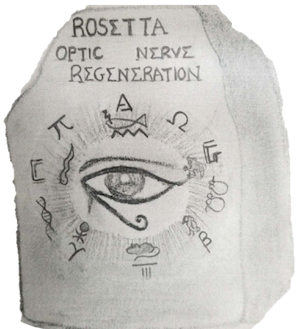

### Regeneration Rosetta:  An interactive web application to explore regeneration-associated gene expression and chromatin accessibility

Andrea Rau, Sumona Dhara, Ava Udvadia, Paul Auer

Time-course high-throughput assays of gene expression and enhancer usage in zebrafish provide a valuable characterization of the dynamic mechanisms governing gene regulatory programs during CNS axon regeneration. To facilitate the exploration and functional interpretation of a set of fully-processed data on regeneration-associated temporal transcription networks, we have created an interactive web application called [*Regeneration Rosetta*](http://ls-external-dev.uwm.edu/rosetta/). Using either built-in or user-provided lists of genes in one of dozens of supported organisms, our web application facilitates the (1) visualization of clustered temporal expression trends; (2) identification of proximal and distal regions of accessible chromatin to expedite downstream motif analysis; and (3) description of enriched functional gene ontology categories. By enabling a straightforward interrogation of these rich data without extensive bioinformatic expertise, Regeneration Rosetta is broadly useful for both a deep investigation of time-dependent regulation during regeneration in zebrafish and hypothesis generation in other organisms.

This repository contains the following source code files used to create the *Regeneration Rosetta* R/Shiny app.

It is organized as follows:

- `index.Rmd`: primary file for *Regeneration Rosetta* app
- `OpticRegen_format.R`: helper file to organize and prepare data outside of the app to improve run time
- `restart.txt`: empty file whose last modified date/time triggers a new deployment on the Shiny server
- `data/`: folder containing all necessary data files for the app to run (essentially .rds files + one Excel file and one SQLite database)
- `images/`: folder containing logos and images
- `misc/`: folder containing a helper script to output data for the 7480 significantly DE transcripts used in the app.

