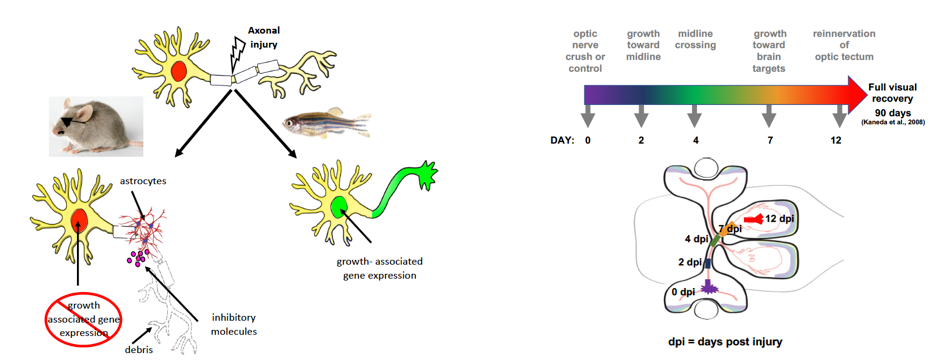

  
```{r packages, include = FALSE}

setRepositories(addURLs = c(BioC = "https://bioconductor.org/packages/3.8/bioc"),
                ind=2)
options(repos = BiocInstaller::biocinstallRepos())
#options(repos = BiocManager::repositories())
getOption("repos")

# BiocManager::install("AnnotationDbi")
# library(AnnotationDbi)

library(flexdashboard)
library(data.table)
library(ComplexHeatmap)
library(tokenizers)
#library(topGO)
library(dplyr)
library(DT)
library(RSQLite)
library(readxl)

#http://bioinfo.umassmed.edu/bootstrappers/guides/main/r_writeFasta.html
writeFasta<-function(data, filename){
  fastaLines = c()
  for (rowNum in 1:nrow(data)){
    fastaLines = c(fastaLines, as.character(data[rowNum,"peak"]))
    fastaLines = c(fastaLines,as.character(data[rowNum,"sequence"]))
  }
  fileConn<-file(filename)
  writeLines(fastaLines, fileConn)
  close(fileConn)
}

sig_transcripts <- readRDS("data/heatmap_sig_transcripts.rds")
sig <- readRDS("data/heatmap_sig_transcripts_bytime.rds")
LFC_all <- readRDS("data/heatmap_LFC.rds")
heatmap_transcripts_to_genes <- readRDS("data/heatmap_transcripts_to_genes.rds")
overall_LRT_pvalues <- readRDS("data/heatmap_overall_LRT_pvalues.rds")

logtpm <- readRDS("data/heatmap_logtpm.rds")
qval_all <- readRDS("data/qval_all.rds")
## AR: May 24, add possibility to filter on 5% DE
sig_transcripts_05 <- rownames(qval_all)[which(apply(qval_all, 1, min) < 0.05)]
## Reorder LFC and qval so that it is in right order
LFC_all <- LFC_all[,c(2,1,3,4)]
qval_all <- qval_all[,c(2,1,3,4)]
colnames(LFC_all) <- strsplit(colnames(LFC_all), split = ".b", fixed= TRUE) %>% unlist()
colnames(qval_all) <- strsplit(colnames(qval_all), split = ".qval", fixed= TRUE) %>% unlist()

## Rerrange LFC_all, qval_all, logtpm, and overall_LRT_pvalues, and heatmap_transcripts_to_genes to have matching order
LFC_all <- LFC_all[match(rownames(logtpm), rownames(LFC_all)),]
qval_all <- qval_all[match(rownames(logtpm), rownames(qval_all)),]
overall_LRT_pvalues <- overall_LRT_pvalues[match(rownames(logtpm), overall_LRT_pvalues$target_id),]
heatmap_transcripts_to_genes <-  
  heatmap_transcripts_to_genes[match(rownames(logtpm), 
                                     heatmap_transcripts_to_genes$target_id),]

## Full correspondance between all ENSDART, ENSDARG, gene symbols
human_ids <- readRDS("data/human_ids.rds")
transcript_to_gene <- readRDS("data/transcripts_to_genes_map.rds")


alias <- readRDS("data/alias.rds")
colnames(alias) <- c("chr_old", "chr")

## Read in ATAC data
# peak_sequences_df <- fread("data/peak_sequences_df.txt")
# peak_sequences_df$start <- as.numeric(peak_sequences_df$start)
# peak_sequences_df$end <- as.numeric(peak_sequences_df$end)
all_proximal_distal_exonfilter <- readRDS("data/all_proximal_distal_exonfilter.rds")
all_proximal_distal_noexonfilter <- readRDS("data/all_proximal_distal_noexonfilter.rds")

## Collect gene names from biomaRt
geneID2GO <- readRDS("data/geneID2GO.rds")

## Read in available species
ds <- readRDS("data/ensembl_ds.rds")

## Read in prenamed clusters
prenamed_clusters <- readRDS("data/prenamed_clusters.rds")
```
  

Welcome
===================================== 


<style type="text/css">
.chart-title {  /* chart_title  */
font-size: 25px;
font-family: Helvetica;
</style>


### Identifying regulatory factors governing regeneration-associated gene expression during Central Nervous System (CNS) regeneration in zebrafish
[Andrea Rau](https://andrea-rau.com), [Sumona P. Dhara](https://uwm.edu/biology/people/dhara-sumona/), [Ava J. Udvadia](https://uwm.edu/biology/people/udvadia-ava/), and [Paul L. Auer](http://people.uwm.edu/pauer/)

<div>
<center>

</center>
</div>

<!-- <div style="width:200px; height=200px"> -->
<!--  -->
<!-- </div> -->


<br>
<br>
<center>


</center>
<br>

<!-- Tutorial -->
<!-- ===================================== -->

<!-- Walk through of a few screengrabs making use of the app. -->


Gene expression
=====================================

Inputs {.sidebar data-width=400}
-----------------------------------------------------------------------


```{r}
## Choose gene set
selectInput("genelist",
            label = "Gene list",
            choices = c(" ", "Read in Excel sheet or .csv",
                        "Built-in gene list",
            # , "Type in my own list (Ensembl IDs)",
                         "Type in my own list (gene symbols)"),
            selected = " ")

## Text input of gene IDs if desired
uiOutput("builtin_list")
uiOutput("read_excel")
uiOutput("custom_list_ensembl")
uiOutput("custom_list_ensembl_org")
uiOutput("custom_list_symbols")
uiOutput("excel_columns")
uiOutput("summary")
output$builtin_list <- renderUI({
  if(input$genelist == "Built-in gene list") {
      selectInput("builtin_choice", label="Available built-in gene lists",
          choices = c("all DE genes", "2dpi-0dpi DE genes", "4dpi-0dpi DE genes", 
                        "7dpi-0dpi DE genes",  "12dpi-0dpi DE genes",
                      unique(prenamed_clusters$cluster_name)),
          selected = c("2dpi-0dpi DE genes"))
  }
})

output$custom_list_ensembl <- renderUI({
  if(input$genelist == "Read in Excel sheet or .csv") {
    radioButtons("ensembl_vss_symbols", label = "Type of ID?",
              choices = c("Zebrafish gene names", "HGNC gene symbols", "Ensembl gene or transcript IDs"),
              selected = "Zebrafish gene names")
  } else if(input$genelist == "Type in my own list (gene symbols)") {
    radioButtons("hugo_vs_symbols", label = "Type of ID?",
              choices = c("Zebrafish gene names", "HGNC gene symbols"),
              selected = "Zebrafish gene names")
  } else  NULL
})

output$custom_list_ensembl_org <- renderUI({
  if(input$genelist == "Read in Excel sheet or .csv") {
    if(!input$ensembl_vss_symbols %in% c("Zebrafish gene names", "HGNC gene symbols")) {
      selectInput("org_choice", label="Select organism",
                choices = ds$description,
                selected = ds$description[1])
    } else NULL
  } else NULL
})

output$custom_list_symbols <- renderUI({
  if(input$genelist == "Type in my own list (gene symbols)") {
    textInput("my_symbols", label="Enter gene names here (space/comma/semicolon delimited)")
  } else NULL
})

## TODO: read in xlsx or csv file
output$read_excel <- renderUI({
  if(input$genelist == "Read in Excel sheet or .csv") {
    fileInput("excel", 
              label = "Choose .xlsx or .csv file (with Ensembl gene/transcript IDs or gene names)",
              accept = c(".xlsx", ".csv"))
  } else NULL
})
output$excel_columns <- renderUI({
    if(input$genelist == "Read in Excel sheet or .csv") {
          if(is.null(input$excel)) 
      return(NULL)
      inFile <- input$excel
      if(length(grep(".xlsx", inFile$datapath))>0) {
          readFile <- read_excel(inFile$datapath)
      } else {
        readFile <- read.csv(inFile$datapath)
      }
      selectInput("column_choice", 
                  label="Column name with gene IDs",
                  choices = colnames(readFile))
    } else NULL
})
output$summary <- renderUI({
  if(!input$genelist %in% c(" ", "Built-in gene list")) {
    textOutput("summary_text")
  } 
})
output$summary_text <- renderText({
  req(input$excel)
  req(gene_select_index())
  req(h())
  if(length(grep(".xlsx", input$excel$datapath))>0) {
      tmp <- read_excel(input$excel$datapath)
  } else {
      tmp <- read.csv(input$excel$datapath)
  }
  paste0(nrow(h()@matrix), 
         " zebrafish transcripts with nonzero variance corresponding to ",
         ifelse(input$genelist == "Read in Excel sheet or .csv", 
                length(na.omit(unique(unlist(tmp[,which(colnames(tmp) ==
                                                          input$column_choice)])))), 
                length(unlist(tokenize_words(as.character(input$my_ensembl),
                                             lowercase=FALSE, strip_numeric=FALSE)))), 
         " unique inputs.",
         ifelse(length(gene_select_index()) == 0, " Check that the appropriate organism is selected above, and that you have provided Ensembl gene IDs or gene names.", ""))
})
```
<br>

```{r}
uiOutput("plot_all_or_DE")
output$plot_all_or_DE <- renderUI({
  if(!input$genelist %in% c(" ", "Built-in gene list")) {
      radioButtons("all_or_DE", 
                label="Gene set choice:",
                choices = c("All genes in list", "Only DE (padj<5%, Wald tests vs 0dpi)", "Only DE (padj<1%, Wald tests vs 0dpi)", 
                  "Only DE (padj<5%, LRT)", "Only DE (padj<1%, LRT)"),
                selected = "All genes in list", inline=FALSE) 
  }
})
## Clustering columns
radioButtons("cluster_cols", 
             label="Column clustering?",
             choices = c("none", "dendrogram"),
             selected = "none", inline=TRUE)

## Clustering rows
radioButtons("cluster_rows", 
             label="Row clustering?", 
             choices = c("none", "dendrogram", "K-means"),
             selected = "dendrogram", inline=TRUE)
uiOutput("kmeans_clusters")
uiOutput("kmeans_clusters_order")
uiOutput("choose_genes_for_GO")
uiOutput("kmeans_download")
## AR: 4/18/19 button to download gene labels
uiOutput("label_download")

output$kmeans_clusters <- renderUI({
  if(input$cluster_rows == "K-means") {
    sliderInput("kmeans_K", label="Number of clusters", min = 2, 
                max = 10, value = 5, step = 1)
  } else NULL
})
output$kmeans_clusters_order <- renderUI({
  if(length(input$kmeans_K) > 0) {
    # if(input$cluster_rows == "K-means") {
    # selectInput("kmeans_order", label="Order of K-means clusters", 
    #             choices = c(1:input$kmeans_K), 
    #             multiple=TRUE, selected = c(1:input$kmeans_K))
    selectizeInput("kmeans_order", label="Order of K-means clusters",
                   choices = c(1:input$kmeans_K),
                   selected = c(1:input$kmeans_K),
                   multiple = TRUE,
                   options = list(plugins = list('drag_drop')))
  } else NULL
})
output$choose_genes_for_GO <- renderUI({
  if(input$cluster_rows == "K-means") {
       selectInput("choose_gene_cluster", label = "Cluster selection for GO analysis",
                 choices = c("All genes", paste0("Cluster ", c(1:input$kmeans_K))),
                 selected = "All genes") 
  }
})

output$kmeans_download <- renderUI({
  if(input$cluster_rows == "K-means") {
    ## Download cluster list
    downloadButton('km_download', "Download K-means cluster labels")
  } else NULL
})
output$km_download <- downloadHandler(filename = function() {
      "heatmap_clusters.csv"}, content = function(file) {
      write.csv(kmeans_labs(), file, row.names=FALSE, quote=FALSE)
      }, contentType="application/csv")
## AR: 4/18/19 Added download buttons
output$label_download <- renderUI({
  if(input$cluster_rows %in% c("none", "dendrogram")) {
    ## Download cluster list
    downloadButton('lbl_download', "Download row labels")
  } else NULL
})
output$lbl_download <- downloadHandler(filename = function() {
      "heatmap_row_labels.csv"}, content = function(file) {
        write.csv(nonkmeans_labs(), file, row.names=FALSE, quote=FALSE)
      }, contentType="application/csv")


## Data to be used
selectInput("heatmap_data",
            label = "Heatmap data",
            choices = c("LFC", "LFC Z-scores", "TPM", "TPM Z-scores", 
                        "TPM Z-scores\n(avg over replicates)"),
            selected = "TPM Z-scores")

## Row and column labels
checkboxInput("col_labels", "Column labels?", value = TRUE)
checkboxInput("row_labels", "Row labels?", value = FALSE)
uiOutput("row_size")
output$row_size <- renderUI({
  if(input$row_labels == TRUE) {
    sliderInput("row_labels_size", label = "Row label size", min = 4, max = 20, step=1, value=10)
  }
})

## Download handler
downloadHandler(filename = function() {
  "heatmap.pdf"}, content = function(file) {
    req(h()@matrix)

    pdf(file, width=as.numeric(input$heatmap_width) / 100, 
               height= as.numeric(input$heatmap_height) / 100)
    print(h())
    dev.off()
  },  contentType="application/pdf", outputArgs=list(label="Download plot (PDF)"))


## Plot dimensions
textInput("heatmap_width", label = "Heatmap width (pixels)", value = 800)
textInput("heatmap_height", label = "Heatmap height (pixels)", value = 600)

## Save ATAC sequences

## Filter out exonic peaks
radioButtons("exonfilter",
            label = "Filter out exonic peaks?",
            choices = c("Yes", "No"),
            selected = "No", inline=TRUE)

uiOutput("display_sequence_downloads1")
uiOutput("display_sequence_downloads2")
```
<br>

```{r}
uiOutput("display_sequence_downloads3")
uiOutput("display_sequence_downloads4")
```
<br>

```{r}
uiOutput("display_sequence_downloads5")
uiOutput("display_sequence_downloads6")
output$display_sequence_downloads1 <- renderUI({
  if(input$genelist != " ") {
    downloadButton('proximal_seq_dl', "Download proximal peaklet sequences (.fasta)")
  }
})
output$display_sequence_downloads2 <- renderUI({
  if(input$genelist != " ") {
    downloadButton('distal_seq_dl', "Download distal peaklet sequences (.fasta)")
  } 
})
output$display_sequence_downloads3 <- renderUI({
  if(input$genelist != " ") {
    downloadButton('proximal_seq_dl2', "Download proximal peaklets (.bed)")
  } 
})
output$display_sequence_downloads4 <- renderUI({
  if(input$genelist != " ") {
    downloadButton('distal_seq_dl2', "Download distal peaklets (.bed)")
  } 
})
output$display_sequence_downloads5 <- renderUI({
  if(input$genelist != " ") {
    downloadButton('proximal_seq_dl3', "Proximal peaklet-to-gene correspondance (.csv)")
  } 
})
output$display_sequence_downloads6 <- renderUI({
  if(input$genelist != " ") {
    downloadButton('distal_seq_dl3', "Distal peaklet-to-gene correspondance (.csv)")
  } 
})
```


Column {.tabset}
-----------------------------------------------------------------------

### Heatmap

```{r}

uiOutput("heatmap_plot")
output$heatmap_plot <- renderUI({
  if(input$genelist == " ") {
    textOutput("no_plot_text")
  } else {
    plotOutput("heatmap", height = as.numeric(input$heatmap_height), 
             width = as.numeric(input$heatmap_width))
  }
})
output$no_plot_text <- renderText({
  "Please choose a gene list to the left, or input your own using either Ensembl IDs or gene symbols."
})

gene_select_index <- reactive({
  
     withProgress(message = 'Matching genes...',  {

  index <- c()
  available_transcripts <- rownames(LFC_all)
  # Choose transcripts
  if(input$genelist == "Built-in gene list") {
    if(input$builtin_choice == "all DE genes") {
      index <- which(available_transcripts %in% sig_transcripts)
    } else if(input$builtin_choice == "2dpi-0dpi DE genes") {
      index <- which(available_transcripts %in% sig[["2dpi-0dpi"]])
    } else if(input$builtin_choice == "4dpi-0dpi DE genes") {
      index <- which(available_transcripts %in% sig[["4dpi-0dpi"]])
    } else if(input$builtin_choice == "7dpi-0dpi DE genes") {
      index <- which(available_transcripts %in% sig[["7dpi-0dpi"]])
    } else if(input$builtin_choice == "12dpi-0dpi DE genes") {
      index <- which(available_transcripts %in% sig[["12dpi-0dpi"]])
    } else {
      index <- which(available_transcripts %in% 
                       unlist(dplyr::select(dplyr::filter(prenamed_clusters, 
                                                          cluster_name == input$builtin_choice), ID)))
    }
  } else if(input$genelist == "Type in my own list (gene symbols)") {
    search <- tokenize_words(as.character(input$my_symbols),
                             lowercase=FALSE, strip_numeric=FALSE) %>% unlist()
    search_tmp <- paste0(unlist(lapply(search, function(x) paste0("^", x, "$", collapse=""))), 
                    collapse = "|") 
    if(length(search)>0) {
      ## AR (April 24, 2019): Determine whether we should look for zebrafish or human genes
      if(input$hugo_vs_symbols == "HGNC gene symbols") {
        find_ensgene <- human_ids %>%
          dplyr::filter(grepl(search_tmp, hgnc_symbol, ignore.case = TRUE)) %>%
          dplyr::select(ens_gene) %>% unlist
        find_ensdart <- unique(transcript_to_gene[which(transcript_to_gene$ens_gene %in% find_ensgene),1])
        index <- which(available_transcripts %in% find_ensdart)
      } else {
        tmp2 <- transcript_to_gene %>% 
                dplyr::filter(grepl(search_tmp, ext_gene, ignore.case = TRUE)) 
        index <- which(available_transcripts %in% tmp2$target_id) 
      }
    } else index <- c()
    ## input$genelist == "Read in Excel sheet or .csv"
  } else {
    req(input$excel)
    inFile <- input$excel
    if(length(grep(".xlsx", inFile$datapath))>0) {
       tmp <- read_excel(inFile$datapath) 
    } else {
      tmp <- read.csv(inFile$datapath)
    }
    choose <- which(colnames(tmp) == input$column_choice)
    search <- na.omit(unique(unlist(tmp[,choose])))
    if(length(search) > 0) {
      if(input$ensembl_vss_symbols == "Ensembl gene or transcript IDs") {
        ## Zebrafish Ensembl transcript IDs
        if(length(grep("ENSDART", search)) > 0) {
          index <- which(available_transcripts %in% search)
        ## Zebrafish Ensembl gene IDs
         } else if(length(grep("ENSDARG", search)) > 0) {
          tmmp <- left_join(data.frame(target_id = available_transcripts),
                     transcript_to_gene, by = "target_id")
          index <- which(tmmp$ens_gene %in% search) 
         ## Arbitrary Ensembl gene IDs (but  as a sanity check, at least half must be Ensembl IDs)
        } else if (length(grep("ENS", search)) >= 0.5*length(search)) {
          library(biomaRt)
          ensembl <- useMart(host = 'mar2016.archive.ensembl.org', 
                   biomart='ENSEMBL_MART_ENSEMBL')
          neworg <- useDataset(ds[which(ds$description == input$org_choice),1], mart=ensembl)
          zebrafish <- useDataset("drerio_gene_ensembl", mart=ensembl)
          new_gene_names <- getLDS(attributes=c("ensembl_gene_id"), filters="ensembl_gene_id",
             values=search,
             mart=neworg, attributesL=c("ensembl_gene_id"), martL=zebrafish)[,2] 
          if(!is.logical(new_gene_names)) {
                tmp <- left_join(data.frame(ens_gene = new_gene_names),
                     transcript_to_gene, by = "ens_gene")
          index <- which(available_transcripts %in% tmp$target_id) 
          } else {
           index <- c()
          }
        } 

      ## Gene symbols
      }  else {
        if(length(search) < 100) {
            search_tmp <- paste0(unlist(lapply(search, function(x) paste0("^", x, "$", collapse=""))), 
                    collapse = "|") 
        } else {
          ## Divide into 10 lists
          tmp <- seq_len(length(search)) %% 10 + 1
          search_tmp <- c()
          for(ii in 1:10) {
            search_tmp[ii] <- paste0(unlist(lapply(search[which(tmp == ii)], 
                                                   function(x) paste0("^", x, "$", collapse=""))), 
                                     collapse = "|") 
          }
        }
          if(input$ensembl_vss_symbols == "Zebrafish gene names") {
            if(length(search_tmp) == 1) {
              tmp2 <- transcript_to_gene %>% 
                dplyr::filter(grepl(search_tmp, ext_gene, ignore.case = TRUE)) 
            } else {
              tmp2 <- dplyr::filter(transcript_to_gene, grepl(search_tmp[1], ext_gene, ignore.case = TRUE))
              incProgress(1/10)
              for(ii in 2:10) {
                 tmp2 <- rbind(tmp2, dplyr::filter(transcript_to_gene, 
                                                   grepl(search_tmp[ii], ext_gene, ignore.case = TRUE)))
                 incProgress(ii/10)
              }
            }
            index <- which(available_transcripts %in% tmp2$target_id) 
          } else {
            if(length(search_tmp) == 1) {
              
        # find_ensgene <- unique(human_ids[which(human_ids$hgnc_symbol %in% search),1])
        # find_ensdart <- unique(transcript_to_gene[which(transcript_to_gene$ens_gene %in% find_ensgene),1])
        # index <- which(tmp$target_id %in% find_ensdart)
        
              tmp2a <- human_ids %>% 
                dplyr::filter(grepl(search_tmp, hgnc_symbol, ignore.case = TRUE)) %>%
                unique() 
              tmp2 <- transcript_to_gene %>%
                dplyr::filter(ens_gene %in% tmp2a[,1]) %>%
                unique()
              # tmp2 <- transcript_to_gene %>% 
              #    dplyr::filter(grepl(search_tmp, hgnc_symbol, ignore.case = TRUE))              
            } else {
              tmp2a <- human_ids %>% 
                dplyr::filter(grepl(search_tmp[1], hgnc_symbol, ignore.case = TRUE)) %>%
                unique() 
              tmp2 <- transcript_to_gene %>%
                dplyr::filter(ens_gene %in% tmp2a[,1]) %>%
                unique()
               # tmp2 <- dplyr::filter(transcript_to_gene, grepl(search_tmp[1], hgnc_symbol, ignore.case = TRUE))
               incProgress(1/10)
               for(ii in 2:10) {
                tmp2a <- human_ids %>% 
                  dplyr::filter(grepl(search_tmp[ii], hgnc_symbol, ignore.case = TRUE)) %>%
                  unique() 
                tmp2 <- rbind(tmp2, transcript_to_gene %>%
                  dplyr::filter(ens_gene %in% tmp2a[,1]) %>%
                  unique())
                 # tmp2 <- rbind(tmp2, dplyr::filter(transcript_to_gene, grepl(search_tmp[ii], hgnc_symbol, ignore.case = TRUE)))
                 incProgress(ii/10)
              }
            }

            index <- which(available_transcripts %in% tmp2$target_id) 
          }
      }
    } else {
      index <- c()
    }
  }
     })
  return(index)
})

heatmap_data_select <- reactive({
  
    if(input$genelist != "Built-in gene list") {
      if(input$all_or_DE == "Only DE (padj<1%, Wald tests vs 0dpi)") {
#      DE_index <- which(overall_LRT_pvalues$qval < 0.05)
       ## AR 4/18/19: use the same differential definition as before
       available_transcripts <- rownames(LFC_all)
       DE_index <- which(available_transcripts %in% sig_transcripts)
       index <- intersect(gene_select_index(), DE_index)
       ## AR 5/24/19: add filtering on 5% as well if desired
      } else if(input$all_or_DE == "Only DE (padj<5%, Wald tests vs 0dpi)") {
       available_transcripts <- rownames(LFC_all)
       DE_index <- which(available_transcripts %in% sig_transcripts_05)
       index <- intersect(gene_select_index(), DE_index)
       ## AR 8/22/19: add filtering on LRT as well if desired
      } else if(input$all_or_DE == "Only DE (padj<1%, LRT)") {
        available_transcripts <- rownames(LFC_all)
        sig_LRT_01 <- overall_LRT_pvalues %>% filter(qval < 0.01) %>%
          dplyr::select(target_id) %>% unlist
        DE_index <- which(available_transcripts %in% sig_LRT_01)
        index <- intersect(gene_select_index(), DE_index)
      } else if(input$all_or_DE == "Only DE (padj<5%, LRT)") {
        available_transcripts <- rownames(LFC_all)
        sig_LRT_05 <- overall_LRT_pvalues %>% filter(qval < 0.05) %>%
          dplyr::select(target_id) %>% unlist
        DE_index <- which(available_transcripts %in% sig_LRT_05)
        index <- intersect(gene_select_index(), DE_index)
      } else {
        index <- intersect(gene_select_index(), which(rowSums(is.na(LFC_all)) < 4))
      }
    } else {
      index <- intersect(gene_select_index(), which(rowSums(is.na(LFC_all)) < 4))
    }
  
  ## Choose data 
  if(input$heatmap_data == "LFC") {
    heatmap_data <- LFC_all[index,]
  } else if(input$heatmap_data == "LFC Z-scores") {
    heatmap_data <- t(scale(t(LFC_all[index,]), center=TRUE, scale=TRUE))
    heatmap_data[is.nan(heatmap_data)] <- 0
  } else if(input$heatmap_data == "TPM") {
    heatmap_data <- logtpm[index,]
  } else if(input$heatmap_data == "TPM Z-scores") {
    heatmap_data <- t(scale(t(logtpm[index,]), center=TRUE, scale=TRUE))
    heatmap_data[is.nan(heatmap_data)] <- 0
  } else {
    col_data <- strsplit(colnames(logtpm), split="dpi") %>%
                         lapply(., function(x) x[1]) %>% unlist()
    tmp_data <- t(rowsum(t(logtpm[index,]), group = col_data, reorder=FALSE)/as.numeric(table(col_data)))
    colnames(tmp_data) <- paste0(colnames(tmp_data), "dpi")
    heatmap_data <- t(scale(t(tmp_data), center=TRUE, scale=TRUE))
  }
  
  heatmap_data_select <- heatmap_data
  remove_index <- unique(c(which(apply(heatmap_data_select, 1, var) == 0), 
                           which(rowSums(is.na(heatmap_data_select)) > 0)))
  if(length(remove_index)>0) {
    heatmap_data_select <- heatmap_data_select[-remove_index,]
  }

  # if(input$genelist %in% c("Input my own list (gene symbols)")) {
  #   rownames(heatmap_data_select) <- left_join(data.frame(target_id = rownames(heatmap_data_select)),
  #                                              heatmap_transcripts_to_genes, by = "target_id") %>%
  #     dplyr::select(ext_gene) %>% unlist() %>% as.character()
  # }
  # if(input$genelist %in% c("Read in Excel sheet or .csv")) {
  #   if(!length(grep("ENSDAR", rownames(heatmap_data_select))))
  #     if(nrow(heatmap_data_select) > 0) {
  #            rownames(heatmap_data_select) <- 
  #              left_join(data.frame(target_id = rownames(heatmap_data_select)),
  #                                              heatmap_transcripts_to_genes, 
  #                        by = "target_id") %>%
  #         dplyr::select(ext_gene) %>% unlist() %>% as.character() 
  #     }
  # }
  
  ## Put rows in original order
  # if(input$cluster_rows == "none") {
  #   heatmap_data_select <- heatmap_data_select[match(search, rownames(heatmap_data_select)),]
  # }
  return(heatmap_data_select)
})

# checkboxInput("col_labels", "Column labels?", value = TRUE)
# checkboxInput("row_labels", "Row labels?", value = FALSE)
# uiOutput("row_size")
# output$row_size <- renderUI({
#   if(input$row_labels == TRUE) {
#     sliderInput("row_labels_size", label = "Row label size", min = 4, max = 20, step=1, value=10)
#   }
# })

h <- reactive({
  req(heatmap_data_select())
  if(input$row_labels == TRUE) {
    row_names_gp <- gpar(fontsize = input$row_labels_size)
  } else {
    row_names_gp <- gpar(fontsize = 12)
  }
  if(input$cluster_rows == "K-means") {
    ## ADDED AUGUST 2019 !!!!!!!!
    suppressWarnings(RNGversion("3.5.1"))
    set.seed(12345)
     kclus <- kmeans(heatmap_data_select(), input$kmeans_K)
     if(length(unique(input$kmeans_order)) != length(unique(kclus$cluster))) {
       h <- NULL
     } else {
       split <- factor(paste0("Cluster ", kclus$cluster), levels = paste0("Cluster ", input$kmeans_order))
       h <- Heatmap(heatmap_data_select(), name = input$heatmap_data, 
          cluster_columns = ifelse(input$cluster_cols != "none", TRUE, FALSE),
          show_row_names = input$row_labels,
          show_column_names = input$col_labels,
          split=split, row_names_gp=row_names_gp)
     }
  } else {
    h <- Heatmap(heatmap_data_select(), name = input$heatmap_data, 
          cluster_rows = ifelse(input$cluster_rows != "none", TRUE, FALSE),
          cluster_columns = ifelse(input$cluster_cols != "none", TRUE, FALSE),
          show_row_names = input$row_labels,
          show_column_names = input$col_labels,
#          km=ifelse(input$cluster_rows == "K-means", input$kmeans_K, 1),
#          km_title = ifelse(input$cluster_rows =="K-means", "Cluster %i", NULL),
          row_names_gp=row_names_gp)
  }
  return(h)
})

nonkmeans_labs <- reactive({
  req(h())
  if(input$cluster_rows %in% c("none", "dendrogram")) {
    ro <- unlist(row_order(h()))
    df <- data.frame(target_id = rownames(h()@matrix)[ro], stringsAsFactors = FALSE)
    df$ID <- df$target_id
       ## AR: June 19, 2019
       # df <- data.frame(target_id = rownames(h()@matrix)[row_order(h())]) %>%
       #  dplyr::select(ID = target_id)
      if(length(grep("ENSDART", df$target_id))>0) {
        # pvaldf <- overall_LRT_pvalues %>% 
        #   dplyr::select(ID = target_id, ext_gene, padj = qval)
        # df <- left_join(df, pvaldf, by=c("ID")) %>%
        #   left_join(., data.frame(ID = rownames(LFC_all), LFC_all, check.names=FALSE))
      ## AR 5/24: return full p-values instead of overall LRT
      pvaldf <- full_join(overall_LRT_pvalues, 
                          data.frame(target_id = rownames(qval_all), qval_all, 
                                     check.names = FALSE, stringsAsFactors = FALSE),
                          by = "target_id") %>% 
        dplyr::select(target_id, ext_gene, qval, everything())
      colnames(pvaldf) <- c("ID", "ext_gene", "LRT_qval", "2dpi-0dpi_qval", "4dpi-0dpi_qval",
                            "7dpi-0dpi_qval", "12dpi-0dpi_qval")
      LFCdf <- data.frame(ID = rownames(LFC_all), LFC_all, check.names=FALSE, stringsAsFactors = FALSE)
      colnames(LFCdf) <- c("ID", "2dpi-0dpi_LFC", "4dpi-0dpi_LFC",
                            "7dpi-0dpi_LFC", "12dpi-0dpi_LFC")
      df <- left_join(df, pvaldf, by=c("ID")) %>%
        left_join(., LFCdf, by = "ID")
      }
    df
  } else NULL
})

kmeans_labs <- reactive({
  req(h())
 if(input$cluster_rows == "K-means") {
   ro <- row_order(h())
   df <- data.frame(row = unlist(ro),
                    Cluster = rep(paste0("Cluster ", input$kmeans_order), 
                                     times = unlist(lapply(ro, length))), stringsAsFactors = FALSE)
   df$ID <- rownames(h()@matrix)[df$row]
   ## I don't need this part as the clusters have already been sorted above
#   levels(df$Cluster) <- levels(h()@matrix_param$split$split)
   df <- df %>% 
     #arrange(Cluster) %>%
     dplyr::select(target_id = ID, Cluster) %>%
     dplyr::select(ID = target_id, Cluster)
   
    # set.seed(12345)
    # kclus <- kmeans(heatmap_data_select(), input$kmeans_K)
    # df <- data.frame(ID=rownames(heatmap_data_select()), Cluster=kclus$cluster)
    if(length(grep("ENSDART", df$ID))>0) {
      # pvaldf <- overall_LRT_pvalues %>% 
      #   dplyr::select(ID = target_id, ext_gene, padj = qval)
      pvaldf <- full_join(overall_LRT_pvalues, 
                          data.frame(target_id = rownames(qval_all), qval_all, 
                                     check.names = FALSE, stringsAsFactors = FALSE),
                          by = "target_id") %>% 
        dplyr::select(target_id, ext_gene, qval, everything())
      colnames(pvaldf) <- c("ID", "ext_gene", "LRT_qval", "2dpi-0dpi_qval", "4dpi-0dpi_qval",
                            "7dpi-0dpi_qval", "12dpi-0dpi_qval")
      LFCdf <- data.frame(ID = rownames(LFC_all), LFC_all, check.names=FALSE, stringsAsFactors = FALSE)
      colnames(LFCdf) <- c("ID", "2dpi-0dpi_LFC", "4dpi-0dpi_LFC",
                            "7dpi-0dpi_LFC", "12dpi-0dpi_LFC")
      df <- left_join(df, pvaldf, by=c("ID")) %>%
        left_join(., LFCdf, by = "ID")
    }
    df                 
  } else NULL
})

output$heatmap <- renderPlot({
  req(h())
  withProgress(message = 'Making plot...', {
    draw(h(), heatmap_legend_side = "left")
  })
})

```


### Corresponding ATAC-seq peaklets

```{r}
uiOutput("sequences")

output$sequences <- renderUI({
   if(input$genelist == " ") {
    textOutput("no_sequences")
   } else if(is.null(h()@matrix)) {
    textOutput("no_sequences")

   } else if(nrow(h()@matrix) == 0) {
    textOutput("no_sequences")
  } else {
    DT::dataTableOutput("anti_dataframe")
  }
})


output$no_sequences <-
  renderText({"This tab provides the sequences of distal and proximal peaks for the set of genes identified on the heatmap tab."})

output$anti_dataframe <-
  DT::renderDataTable({
    req(sequences_format())
    DT::datatable(sequences_format()[["anti"]],
                  caption = paste0("Click the download buttons at bottom left to obtain the sequences for the ", nrow(sequences_format()[["proximal_peaks_withgenes_seq"]]), " proximal and ", nrow(sequences_format()[["distal_peaks_withgenes_seq"]]), " distal peaks to the set of ", sequences_format()[["ngenes"]], " genes in the list. In the below table, you will find the genes for which no proximal (", nrow(dplyr::filter(sequences_format()[["anti"]], `Proximal peak?`=="No")), ") or distal (", 
                                 nrow(dplyr::filter(sequences_format()[["anti"]], `Distal peak?`=="No")), ") peaks were found."),
                options=list(
                  deferRender=TRUE,
                  scrollY = 500,
                  scrollCollapse = TRUE,
                  paging = FALSE,
                  dom = 'Bfrtip',
                  buttons = c('copy', 'csv', 'excel', 'pdf', 'print')),                 
                rownames=FALSE,
                filter=list(position="top", clear=TRUE, plain=FALSE),
                extensions = "Buttons")
})
  

# output$go_proximal_distal_df <-
#   DT::renderDataTable({
#    req(peak_sel())
#    withProgress(message = 'Running topGO analysis...', value = 0, {
# 
#     DT::datatable(topgo_proximal_distal(),
#                   caption = "",
#                 options=list(
#                   deferRender=TRUE,
#                   scrollY = 500,
#                   scrollCollapse = TRUE,
#                   paging = FALSE,
#                   dom = 'Bfrtip',
#                   buttons = c('copy', 'csv', 'excel', 'pdf', 'print')), 
#                 rownames=FALSE,
#                 filter=list(position="top", clear=TRUE, plain=FALSE),
#                 extensions = 'Buttons') %>%
#     DT::formatStyle(columns = 2, fontSize = '75%')
# 
#   })
# })


sequences_format <- reactive({
  req(h())
  ensembl_ids <- data.frame(target_id = rownames(h()@matrix)) %>%
    left_join(., dplyr::select(transcript_to_gene, target_id, ens_gene, ext_gene), by = "target_id") %>%
    na.omit() ## Only keep transcript IDs with a corresponding gene ID
  
  if(input$exonfilter == "Yes") {
      all_proximal_distal <- all_proximal_distal_exonfilter
  } else {
      all_proximal_distal <- all_proximal_distal_noexonfilter
  }
  select_proximal_distal <- dplyr::filter(all_proximal_distal, ens_gene %in% unlist(ensembl_ids$ens_gene))

#ggact.3
#1 chr1 2301487 2301986 ENSDARG00000070579 proximal
#2 chr1 2301487 2301986 ENSDARG00000070579   distal

  ## Sets of proximal and distal peaks to the selected genes  
  proximal_peaks <- dplyr::filter(select_proximal_distal, type == "proximal") %>%
    dplyr::select(chr, start, end) %>% unique()
  distal_peaks <- dplyr::filter(select_proximal_distal, type == "distal") %>%
    dplyr::select(chr, start, end) %>% unique()
  
  ## Pull all genes for each of those peak sets
  proximal_peaks_withgenes <- left_join(proximal_peaks, select_proximal_distal, 
                                        by = c("chr", "start", "end")) %>%
    dplyr::filter(type == "proximal") %>%
    left_join(., alias, by="chr") %>%
    left_join(., dplyr::select(transcript_to_gene, target_id, ens_gene, ext_gene), by = "ens_gene") %>%
    dplyr::select(-target_id) %>% unique()
  distal_peaks_withgenes <- left_join(distal_peaks, 
                                      select_proximal_distal, 
                                      by = c("chr", "start", "end")) %>%
    dplyr::filter(type == "distal") %>%
    left_join(., alias, by="chr") %>%
    left_join(., dplyr::select(transcript_to_gene, target_id, ens_gene, ext_gene), by = "ens_gene") %>%
    dplyr::select(-target_id) %>% unique()
  
  ## Pull sequences from SQLite database
  sqldb <- dbConnect(SQLite(), dbname="data/rosetta.sqlite")
  chr_in <- paste0("(", paste0("'", unique(proximal_peaks_withgenes$chr), "'", collapse=", "), ")")
  chr_old_in <- paste0("(", paste0("'", unique(proximal_peaks_withgenes$chr_old), "'", collapse=", "), ")")
  start_in <- paste0("(", paste0("'", unique(proximal_peaks_withgenes$start), "'", collapse=", "), ")")
  end_in <- paste0("(", paste0("'", unique(proximal_peaks_withgenes$end), "'", collapse=", "), ")")
  peak_sequences_df_prox <- dbGetQuery(sqldb, paste0("select * from peak_sequences_df where start in ", start_in,
                                                    " and end in ", end_in, " and chr in ", chr_in, 
                                                    " and chr_old in ", chr_old_in))
  chr_in <- paste0("(", paste0("'", unique(distal_peaks_withgenes$chr), "'", collapse=", "), ")")
  chr_old_in <- paste0("(", paste0("'", unique(distal_peaks_withgenes$chr_old), "'", collapse=", "), ")")
  start_in <- paste0("(", paste0("'", unique(distal_peaks_withgenes$start), "'", collapse=", "), ")")
  end_in <- paste0("(", paste0("'", unique(distal_peaks_withgenes$end), "'", collapse=", "), ")")
  peak_sequences_df_dist <- dbGetQuery(sqldb, paste0("select * from peak_sequences_df where start in ", start_in,
                                                    " and end in ", end_in, " and chr in ", chr_in, 
                                                    " and chr_old in ", chr_old_in))
  dbDisconnect(sqldb)
  
  proximal_peaks_withgenes_seq <- proximal_peaks_withgenes %>%
    dplyr::select(-ens_gene, -ext_gene) %>%
    unique() %>%
    mutate(peak = paste0(">", chr, ":", start, "-", end))  %>%
    left_join(., peak_sequences_df_prox, by = c("chr_old", "chr", "start", "end")) %>%
    na.omit()
  distal_peaks_withgenes_seq <- distal_peaks_withgenes %>%
    dplyr::select(-ens_gene, -ext_gene) %>%
    unique() %>%
    mutate(peak = paste0(">", chr, ":", start, "-", end))  %>%
    left_join(., peak_sequences_df_dist, by = c("chr_old", "chr", "start", "end")) %>%
    na.omit()

  ## Genes that are NOT annotated with proximal/distal peaks
  anti_proximal <- anti_join(ensembl_ids, proximal_peaks_withgenes, by = "ens_gene") %>%
    dplyr::select(ext_gene) %>% unique()
  anti_distal <- anti_join(ensembl_ids, distal_peaks_withgenes, by = "ens_gene") %>%
    dplyr::select(ext_gene) %>% unique()
  tmp_anti <- unique(c(anti_proximal$ext_gene, anti_distal$ext_gene))
  anti <- data.frame(`Gene Symbol` = tmp_anti, 
                     `Proximal peak?` = ifelse(tmp_anti %in% anti_proximal$ext_gene, 
                                               "No", "Yes"),
                     `Distal peak?` = ifelse(tmp_anti %in% anti_distal$ext_gene, 
                                             "No", "Yes"),
                     check.names=FALSE)
  
  tmp <- list(proximal_peaks_withgenes = proximal_peaks_withgenes,
              distal_peaks_withgenes = distal_peaks_withgenes, 
              proximal_peaks_withgenes_seq = proximal_peaks_withgenes_seq,
              distal_peaks_withgenes_seq = distal_peaks_withgenes_seq, 
              anti = anti,
              ngenes = length(rownames(h()@matrix)))
  return(tmp)
})

output$proximal_seq_dl <- downloadHandler(filename=function() {
  "proximal_sequences.fasta"}, content = function(file) {
    # write.table(file=file, x=sequences_format()[["proximal_sequences"]], quote=FALSE, row.names=FALSE, col.names=FALSE, sep="\t")
    writeFasta(sequences_format()[["proximal_peaks_withgenes_seq"]], filename=file)
  },
  contentType = "application/txt")

output$distal_seq_dl <- downloadHandler(filename=function() {
  "distal_sequences.fasta"}, content = function(file) {
#    write.table(file=file, x=sequences_format()[["distal_sequences"]], quote=FALSE, #row.names=FALSE, col.names=FALSE, sep="\t")
     writeFasta(sequences_format()[["distal_peaks_withgenes_seq"]], filename=file)

  },
  contentType = "application/txt")
output$proximal_seq_dl2 <- downloadHandler(filename=function() {
  "proximal_sequences.bed"}, content = function(file) {
    tmp <- sequences_format()[["proximal_peaks_withgenes_seq"]] %>%
      dplyr::select(chr, start, end)
    write.table(tmp, file=file, sep="\t", col.names=FALSE, quote=FALSE, row.names=FALSE)
  },
  contentType = "application/txt")

output$distal_seq_dl2 <- downloadHandler(filename=function() {
  "distal_sequences.bed"}, content = function(file) {
    tmp <- sequences_format()[["distal_peaks_withgenes_seq"]] %>%
      dplyr::select(chr, start, end)
    write.table(tmp, file=file, sep="\t", col.names=FALSE, quote=FALSE, row.names=FALSE)
  },
  contentType = "application/txt")
output$proximal_seq_dl3 <- downloadHandler(filename=function() {
  "proximal_peaklet-to-gene.csv"}, content = function(file) {
    tmp <- sequences_format()[["proximal_peaks_withgenes"]] %>%
      dplyr::select(-type, -chr_old)
    write.csv(tmp, file=file)
  },
  contentType = "application/csv")

output$distal_seq_dl3 <- downloadHandler(filename=function() {
  "distal_peaklet-to-gene.csv"}, content = function(file) {
    tmp <- sequences_format()[["distal_peaks_withgenes"]] %>%
      dplyr::select(-type, -chr_old)
    write.csv(tmp, file=file)
      },
  contentType = "application/csv")


```

### GO enrichment analysis

```{r}
## Gene ontology to be used
radioButtons("gene_ontology2",
            label = "Gene Ontology",
            choices = c("BP", "CC", "MF"),
            selected = "BP", inline=TRUE)

uiOutput("go_genelist_output")

output$go_genelist_output <- renderUI({
  if(input$genelist == " ") {
    textOutput("no_plot_text2")
  } else {
    DT::dataTableOutput("go_genelist_df")
  }
})

output$no_plot_text2 <- renderText({
  "Please choose a gene list to the left, or input your own using either Ensembl IDs or gene symbols."
})

go_genelist <- reactive({
  req(h())
  if(input$cluster_rows != "K-means") {
      targets_index <- unlist(row_order(h()))
  } else {
    if(input$choose_gene_cluster == "All genes") {
      targets_index <- unlist(row_order(h()))
    } else {
      choose <- which(input$kmeans_order == as.numeric(substr(input$choose_gene_cluster, 9, 20)))
      ## AR: 4/18/19 make sure that GO analysis picks correct cluster after reordering
      targets_index <- row_order(h())[[choose]]
    }
  }
  targets <- data.frame(target_id = rownames(h()@matrix)[targets_index],
                        stringsAsFactors = FALSE) %>%
    left_join(., dplyr::select(transcript_to_gene, target_id, ens_gene, ext_gene), by="target_id") %>%
    dplyr::select(ext_gene) %>% unlist() %>% unique()
  allGenes <- data.frame(target_id =
                             rownames(LFC_all)[which(rownames(LFC_all) != "TRANSGENE")],
                           stringsAsFactors = FALSE) %>%
      left_join(., dplyr::select(transcript_to_gene, target_id, ens_gene, ext_gene), by = "target_id") %>%
      dplyr::select(ext_gene) %>% na.omit() %>%
      unlist() %>% unique()

  geneList <- factor(as.integer(allGenes %in% targets))
  names(geneList) <- allGenes

  ## topGO analysis -------------------------------------------------------
  library(topGO)
  GOdata <- new("topGOdata",
                ontology=input$gene_ontology2,
                allGenes=geneList,
                annot = annFUN.gene2GO,
                gene2GO = geneID2GO)
  resultsFisher <- runTest(GOdata, algorithm = "weight01", statistic = "fisher")
  resultsTable <- GenTable(object = GOdata, pvalue = resultsFisher,
                           orderBy = "pvalue",
                           ranksOf = "pvalue",
                           topNodes = length(resultsFisher@score), numChar=1000) %>%
        dplyr::filter(pvalue < 0.05)  %>%
      arrange(desc(Significant))
#  resultsTable
  
  ## Add genes annotated for each GO term
  allGO <- genesInTerm(GOdata)
  allGO_subset <- allGO[which(names(allGO) %in% resultsTable$GO.ID)] %>%
    lapply(., function(x) paste0(x[which(x %in% targets)], collapse=";"))
  allGO_df <- data.frame(GO.ID = names(allGO_subset), Genes = unlist(allGO_subset))
  rownames(allGO_df) <- NULL
  resultsTable <- left_join(resultsTable, allGO_df, by = "GO.ID")
  resultsTable

})


output$go_genelist_df <-
  DT::renderDataTable({
        req(h())
   withProgress(message = 'Running topGO analysis...', {

    DT::datatable(
      go_genelist(),
                caption = "", 
                rownames=FALSE,
                filter=list(position="top", clear=TRUE, plain=FALSE),
                extensions = 'Buttons',               
                options=list(
                  deferRender=TRUE,
                  scrollY = 500,
                  scrollCollapse = TRUE,
                  paging = FALSE,
                  dom = 'Bfrtip',
                  buttons = c('copy', 'csv', 'excel', 'pdf', 'print'))) %>%
    DT::formatStyle(columns = 2, fontSize = '75%')
  })
})
```

Open Chromatin
=====================================


Inputs {.sidebar data-width=400}
-----------------------------------------------------------------------

Note: peak coordinates correspond to the Danio rerio GRCz10 genome build. Only genomic regions overlapping ATAC-seq peaklets are used in this analysis.

```{r}
## Choose peak set
selectInput("peaklist",
            label = "Peak list",
            choices = c(" ", "Read in .bed file",
                        "Built-in peak list"),
            selected = " ")

## Text input of gene IDs if desired
uiOutput("builtin_list_peak")
uiOutput("read_bed_peak")
output$builtin_list_peak <- renderUI({
  if(input$peaklist == "Built-in peak list") {
      selectInput("builtin_choice_peak", label="Available built-in peak lists",
          choices = c("all DO peaks", "2dpi > 0dpi DO peaks", "12dpi < 0dpi DO peaks"))
  }
})
output$read_bed_peak <- renderUI({
    if(input$peaklist == "Read in .bed file") {
    fileInput("bed", "Choose .bed file",
              accept = c(".bed"))
  } else NULL
})

selectInput("genechoice", 
             label="Gene set (padj < 0.05 for DE genes)", 
             choices = c("All genes", "All DE genes", "2dpi vs 0dpi DE", "2dpi > 0dpi DE", "2dpi < 0dpi DE",
                         "4dpi vs 0dpi DE",
                         "4dpi > 0dpi DE", "4dpi < 0dpi DE", "7dpi vs 0dpi DE", "7dpi > 0dpi DE", "7dpi < 0dpi DE",
                         "12dpi vs 0dpi DE",
                         "12dpi > 0dpi DE", "12dpi < 0dpi DE"),
             selected = "All DE genes")


## Gene ontology to be used
selectInput("gene_ontology",
            label = "Gene Ontology",
            choices = c("BP", "CC", "MF"),
            selected = "BP")

## Text input of gene IDs if desired
uiOutput("genes_for_chromatin_GO")
output$genes_for_chromatin_GO <- renderUI({
    if((input$peaklist == "Read in .bed file" & !is.null(input$bed)) | 
       input$peaklist == "Built-in peak list") {
    downloadButton('genes_for_chromatin_GO_dl', "Proximal & distal gene IDs")
  } else NULL
})

```


Column {.tabset}
-----------------------------------------------------------------------

```{r}
peak_sel <- reactive({
  ## Built-in peak list
  if(input$peaklist == "Built-in peak list") {
    req(input$builtin_choice_peak)
    if(input$builtin_choice_peak == "all DO peaks") {
     peak_selection <- read.table("data/sigpeaks_all_peaklets_500bp.bed")
    } else if(input$builtin_choice_peak == "2dpi > 0dpi DO peaks") {
      peak_selection <- read.table("data/sigpeaks_2vs0_peaklets_500bp_up.bed")
    } else {
      peak_selection <- read.table("data/sigpeaks_12vs0_peaklets_500bp_down.bed")
    }
    colnames(peak_selection) <- c("chr_old", "start", "end")
    peak_selection <- left_join(peak_selection, alias, by = "chr_old") %>%
      dplyr::select(chr, start, end)
  ## Read in bed file
  } else if(input$peaklist == "Read in .bed file") {
    req(input$bed)
    peak_selection <- read.table(input$bed$datapath)
    colnames(peak_selection) <- c("chr", "start", "end")
  ## TODO: Excel sheet (option for single column or three named columns)
  } else if(input$peaklist == "Read in Excel sheet or .csv") {
    NULL
  ## TODO: type in own list
  } else {
    NULL
  }
  ## TODO: Add check for old formatting of chromosomes
  ## TODO: Output something about number of genomic regions not overlapping any peaks
  return(peak_selection)
})

gene_sel <- reactive({
  req(input$genechoice)
  LFC_tmp <- data.frame(target_id = rownames(LFC_all), LFC_all, 
                        check.names=FALSE, stringsAsFactors = FALSE)
  qval_tmp <- data.frame(target_id = rownames(qval_all), qval_all, 
                        check.names=FALSE, stringsAsFactors = FALSE)
  if(input$genechoice == "All DE genes") {
    gene_selection <- qval_tmp %>%
      mutate(min = apply(qval_tmp[,-1], 1, min)) %>%
      dplyr::filter(min < 0.05) %>% 
      dplyr::select(target_id) %>% dplyr::filter(target_id != "TRANSGENE") %>%
      left_join(., transcript_to_gene, by = "target_id") %>%
      dplyr::select(ens_gene) %>% unlist() %>% unique()
  } else if(input$genechoice == "2dpi vs 0dpi DE") {
    gene_selection <- qval_tmp %>%
      dplyr::filter(`2dpi-0dpi` < 0.05) %>% 
      dplyr::select(target_id) %>% dplyr::filter(target_id != "TRANSGENE") %>%
      left_join(., transcript_to_gene, by = "target_id") %>%
      dplyr::select(ens_gene) %>% unlist() %>% unique()
  } else if(input$genechoice == "4dpi vs 0dpi DE") {
    gene_selection <- qval_tmp %>%
      dplyr::filter(`4dpi-0dpi` < 0.05) %>% 
      dplyr::select(target_id) %>% dplyr::filter(target_id != "TRANSGENE") %>%
      left_join(., transcript_to_gene, by = "target_id") %>%
      dplyr::select(ens_gene) %>% unlist() %>% unique()
  } else if(input$genechoice == "7dpi vs 0dpi DE") {
    gene_selection <- qval_tmp %>%
      dplyr::filter(`7dpi-0dpi` < 0.05) %>% 
      dplyr::select(target_id) %>% dplyr::filter(target_id != "TRANSGENE") %>%
      left_join(., transcript_to_gene, by = "target_id") %>%
      dplyr::select(ens_gene) %>% unlist() %>% unique()
  } else if(input$genechoice == "12dpi vs 0dpi DE") {
    gene_selection <- qval_tmp %>%
      dplyr::filter(`12dpi-0dpi` < 0.05) %>% 
      dplyr::select(target_id) %>% dplyr::filter(target_id != "TRANSGENE") %>%
      left_join(., transcript_to_gene, by = "target_id") %>%
      dplyr::select(ens_gene) %>% unlist() %>% unique()
  } else if(input$genechoice == "2dpi > 0dpi DE") {
    gene_selection <- qval_tmp %>%
      dplyr::filter(`2dpi-0dpi` < 0.05) %>% 
      left_join(., LFC_tmp, by = "target_id") %>%
      dplyr::filter(`2dpi-0dpi.y` > 0) %>%
      dplyr::select(target_id) %>% dplyr::filter(target_id != "TRANSGENE") %>%
      left_join(., transcript_to_gene, by = "target_id") %>%
      dplyr::select(ens_gene) %>% unlist() %>% unique()
  } else if(input$genechoice == "2dpi < 0dpi DE") {
    gene_selection <- qval_tmp %>%
      dplyr::filter(`2dpi-0dpi` < 0.05) %>% 
      left_join(., LFC_tmp, by = "target_id") %>%
      dplyr::filter(`2dpi-0dpi.y` < 0) %>%
      dplyr::select(target_id) %>% dplyr::filter(target_id != "TRANSGENE") %>%
      left_join(., transcript_to_gene, by = "target_id") %>%
      dplyr::select(ens_gene) %>% unlist() %>% unique()
  } else if(input$genechoice == "4dpi > 0dpi DE") {
    gene_selection <- qval_tmp %>%
      dplyr::filter(`4dpi-0dpi` < 0.05) %>% 
      left_join(., LFC_tmp, by = "target_id") %>%
      dplyr::filter(`4dpi-0dpi.y` > 0) %>%
      dplyr::select(target_id) %>% dplyr::filter(target_id != "TRANSGENE") %>%
      left_join(., transcript_to_gene, by = "target_id") %>%
      dplyr::select(ens_gene) %>% unlist() %>% unique()
  } else if(input$genechoice == "4dpi < 0dpi DE") {
    gene_selection <- qval_tmp %>%
      dplyr::filter(`4dpi-0dpi` < 0.05) %>% 
      left_join(., LFC_tmp, by = "target_id") %>%
      dplyr::filter(`4dpi-0dpi.y` < 0) %>%
      dplyr::select(target_id) %>% dplyr::filter(target_id != "TRANSGENE") %>%
      left_join(., transcript_to_gene, by = "target_id") %>%
      dplyr::select(ens_gene) %>% unlist() %>% unique()
  } else if(input$genechoice == "7dpi > 0dpi DE") {
    gene_selection <- qval_tmp %>%
      dplyr::filter(`7dpi-0dpi` < 0.05) %>% 
      left_join(., LFC_tmp, by = "target_id") %>%
      dplyr::filter(`7dpi-0dpi.y` > 0) %>%
      dplyr::select(target_id) %>% dplyr::filter(target_id != "TRANSGENE") %>%
      left_join(., transcript_to_gene, by = "target_id") %>%
      dplyr::select(ens_gene) %>% unlist() %>% unique()
  } else if(input$genechoice == "7dpi < 0dpi DE") {
    gene_selection <- qval_tmp %>%
      dplyr::filter(`7dpi-0dpi` < 0.05) %>% 
      left_join(., LFC_tmp, by = "target_id") %>%
      dplyr::filter(`7dpi-0dpi.y` < 0) %>%
      dplyr::select(target_id) %>% dplyr::filter(target_id != "TRANSGENE") %>%
      left_join(., transcript_to_gene, by = "target_id") %>%
      dplyr::select(ens_gene) %>% unlist() %>% unique()
  }  else if(input$genechoice == "12dpi > 0dpi DE") {
    gene_selection <- qval_tmp %>%
      dplyr::filter(`12dpi-0dpi` < 0.05) %>% 
      left_join(., LFC_tmp, by = "target_id") %>%
      dplyr::filter(`12dpi-0dpi.y` > 0) %>%
      dplyr::select(target_id) %>% dplyr::filter(target_id != "TRANSGENE") %>%
      left_join(., transcript_to_gene, by = "target_id") %>%
      dplyr::select(ens_gene) %>% unlist() %>% unique()
  } else if(input$genechoice == "12dpi < 0dpi DE") {
    gene_selection <- qval_tmp %>%
      dplyr::filter(`12dpi-0dpi` < 0.05) %>% 
      left_join(., LFC_tmp, by = "target_id") %>%
      dplyr::filter(`12dpi-0dpi.y` < 0) %>%
      dplyr::select(target_id) %>% dplyr::filter(target_id != "TRANSGENE") %>%
      left_join(., transcript_to_gene, by = "target_id") %>%
      dplyr::select(ens_gene) %>% unlist() %>% unique()
  } else {
    gene_selection <- left_join(data.frame(target_id = rownames(LFC_all)), 
                                transcript_to_gene, by = "target_id") %>%
      dplyr::select(ens_gene) %>% unlist() %>% unique()
  }
  return(gene_selection)
})
    
find_genes <- reactive({
  ## Using GenomicRanges
    # find_all_genes <- all_proximal_distal_noexonfilter[
    #   (as.data.frame(findOverlaps(GRanges(all_proximal_distal_noexonfilter), 
    #                                     GRanges(peak_sel())))$queryHits),] %>%
    #   dplyr::filter(ens_gene %in% gene_sel())
    req(peak_sel())
  ## Using data.table
    all_proximal_distal_noexonfilter_DT <- data.table(all_proximal_distal_noexonfilter)
    peak_sel_DT <- data.table(peak_sel())
    setkey(all_proximal_distal_noexonfilter_DT, start, end)
    setkey(peak_sel_DT, start, end)

    find_all_genes <- foverlaps(all_proximal_distal_noexonfilter_DT, peak_sel_DT,
                                nomatch=0L) %>%
      as.data.frame() %>%
      mutate(chr = as.character(chr), 
             i.chr = as.character(i.chr))

    ## AR: 4/18/19 Double check that chromosome names match
    if(length(grep("CM", find_all_genes$chr)) > 0) {
      alias2 <- alias
      alias2$chr <- as.character(alias2$chr)
      alias2$chr[grep("chrUn", alias2$chr)] <- substr(alias2$chr[grep("chrUn", alias2$chr)], 7, 30)
      alias2$chr[grep("v1", alias2$chr)] <- gsub("v", ".", alias2$chr[grep("v1", alias2$chr)])
      colnames(alias2) <- c("chr", "chr_new")
      find_all_genes <- left_join(find_all_genes, alias2, by = "chr") %>%
        dplyr::select(-chr) %>%
        mutate(chr = chr_new) %>%
        dplyr::select(-chr_new)
    }
    
    find_all_genes <- find_all_genes %>%
      filter(chr == i.chr, ens_gene %in% gene_sel()) %>%
      arrange(chr, start)

    return(find_all_genes)
})

output$genes_for_chromatin_GO_dl <- downloadHandler(filename=function() {
  "chromatin-GO_proximal-distal_genes.csv"}, content = function(file) {
    # tmp <- sequences_format()[["proximal_peaks_withgenes"]] %>%
    #   dplyr::select(-type, -chr_old)
    req(find_genes())
    targets <- find_genes() %>% 
      left_join(., transcript_to_gene, by="ens_gene") %>%
      dplyr::select(ext_gene, type) %>% 
      arrange(desc(type), ext_gene) %>%
      group_by(ext_gene, type) %>%
      unique()
    write.csv(targets, file=file, row.names = FALSE, quote = FALSE)
  },
  contentType = "application/csv")

```

### Proximal genes

```{r}
uiOutput("go_proximal")
output$go_proximal <- renderUI({
  if(input$peaklist == " ") {
    textOutput("no_peaks")
  } else {
    DT::dataTableOutput("go_proximal_df")
  }
})

output$no_peaks <-
  renderText({"This tab provides a GO enrichment analysis of proximal genes to the set of peaks identified on the left."})

topgo_proximal <- reactive({
  req(find_genes())
    targets <- find_genes() %>% dplyr::filter(type == "proximal") %>%
      left_join(., transcript_to_gene, by="ens_gene") %>%
      dplyr::select(ext_gene) %>% unlist() %>% unique()
  if(length(targets) > 0) {
         allGenes <- data.frame(target_id = 
                             rownames(LFC_all)[-which(rownames(LFC_all) == "TRANSGENE")],
                           stringsAsFactors = FALSE) %>%
      left_join(., transcript_to_gene, by = "target_id") %>%
      dplyr::select(ext_gene) %>% na.omit() %>%
      unlist() %>% unique()
    
    geneList <- factor(as.integer(allGenes %in% targets))
    names(geneList) <- allGenes

    ## topGO analysis -------------------------------------------------------
    library(topGO)
    GOdata <- new("topGOdata",
                ontology=input$gene_ontology,
                allGenes=geneList,
                annot = annFUN.gene2GO,
                gene2GO = geneID2GO)
    resultsFisher <- runTest(GOdata, algorithm = "weight01", statistic = "fisher")
    resultsTable <- GenTable(object = GOdata, pvalue = resultsFisher,
                           orderBy = "pvalue",
                           ranksOf = "pvalue",
                           topNodes = length(resultsFisher@score), numChar=1000) %>%
        dplyr::filter(pvalue < 0.05)  %>%
      arrange(desc(Significant))
#    resultsTable
    
  ## Add genes annotated for each GO term
  allGO <- genesInTerm(GOdata)
  allGO_subset <- allGO[which(names(allGO) %in% resultsTable$GO.ID)] %>%
    lapply(., function(x) paste0(x[which(x %in% targets)], collapse=";"))
  allGO_df <- data.frame(GO.ID = names(allGO_subset), Genes = unlist(allGO_subset))
  rownames(allGO_df) <- NULL
  resultsTable <- left_join(resultsTable, allGO_df, by = "GO.ID") 
  } else {
    resultsTable <- data.frame(Message = "No proximal genes were found.")
  }
  resultsTable
})


output$go_proximal_df <-
  DT::renderDataTable({
    req(find_genes())
   withProgress(message = 'Running topGO analysis...',  {

    DT::datatable(topgo_proximal(),
                  caption = "",
                options=list(
                  deferRender=TRUE,
                  scrollY = 500,
                  scrollCollapse = TRUE,
                  paging = FALSE,
                  dom = 'Bfrtip',
                  buttons = c('copy', 'csv', 'excel', 'pdf', 'print')), 
                rownames=FALSE,
                filter=list(position="top", clear=TRUE, plain=FALSE),
                extensions = 'Buttons') %>%
    DT::formatStyle(columns = 2, fontSize = '75%')

  })
})
```

### Distal genes

```{r}
uiOutput("go_distal")
output$go_distal <- renderUI({
  if(input$peaklist == " ") {
    textOutput("no_peaks2")
  } else {
    DT::dataTableOutput("go_distal_df")
  }
})

output$no_peaks2 <-
  renderText({"This tab provides a GO enrichment analysis of distal genes to the set of peaks identified on the left."})

topgo_distal <- reactive({
    req(find_genes())
    targets <- find_genes() %>% dplyr::filter(type == "distal") %>%
      left_join(., transcript_to_gene, by="ens_gene") %>%
      dplyr::select(ext_gene) %>% unlist() %>% unique()
  if(length(targets) > 0) {

    allGenes <- data.frame(target_id = 
                          rownames(LFC_all)[-which(rownames(LFC_all) == "TRANSGENE")],
                           stringsAsFactors = FALSE) %>%
      left_join(., transcript_to_gene, by = "target_id") %>%
      dplyr::select(ext_gene) %>% na.omit() %>%
      unlist() %>% unique()
    geneList <- factor(as.integer(allGenes %in% targets))
    names(geneList) <- allGenes

    ## topGO analysis -------------------------------------------------------
    library(topGO)
    GOdata <- new("topGOdata",
                ontology=input$gene_ontology,
                allGenes=geneList,
                annot = annFUN.gene2GO,
                gene2GO = geneID2GO)
    resultsFisher <- runTest(GOdata, algorithm = "weight01", statistic = "fisher")
    resultsTable <- GenTable(object = GOdata, pvalue = resultsFisher,
                           orderBy = "pvalue",
                           ranksOf = "pvalue",
                           topNodes = length(resultsFisher@score), numChar=1000) %>%
        dplyr::filter(pvalue < 0.05)  %>%
      arrange(desc(Significant))
#    resultsTable
    
  ## Add genes annotated for each GO term
  allGO <- genesInTerm(GOdata)
  allGO_subset <- allGO[which(names(allGO) %in% resultsTable$GO.ID)] %>%
    lapply(., function(x) paste0(x[which(x %in% targets)], collapse=";"))
  allGO_df <- data.frame(GO.ID = names(allGO_subset), Genes = unlist(allGO_subset))
  rownames(allGO_df) <- NULL
  resultsTable <- left_join(resultsTable, allGO_df, by = "GO.ID")
  } else {
    resultsTable <- data.frame(Message = "No distal genes were found.")
  }
  resultsTable
})


output$go_distal_df <-
  DT::renderDataTable({
   req(peak_sel())
   withProgress(message = 'Running topGO analysis...', {

    DT::datatable(topgo_distal(),
                  caption = "",
                options=list(
                  deferRender=TRUE,
                  scrollY = 500,
                  scrollCollapse = TRUE,
                  paging = FALSE,
                  dom = 'Bfrtip',
                  buttons = c('copy', 'csv', 'excel', 'pdf', 'print')), 
                rownames=FALSE,
                filter=list(position="top", clear=TRUE, plain=FALSE),
                extensions = 'Buttons') %>%
    DT::formatStyle(columns = 2, fontSize = '75%')

  })
})
```

### Proximal + distal genes 

```{r}
uiOutput("go_proximal_distal")
output$go_proximal_distal <- renderUI({
  if(input$peaklist == " ") {
    textOutput("no_peaks3")
  } else {
    DT::dataTableOutput("go_proximal_distal_df")
  }
})

output$no_peaks3 <-
  renderText({"This tab provides a GO enrichment analysis of proximal and distal genes to the set of peaks identified on the left."})

topgo_proximal_distal <- reactive({
    req(find_genes())
    targets <- find_genes()  %>%
      left_join(., transcript_to_gene, by="ens_gene") %>%
      dplyr::select(ext_gene) %>% unlist() %>% unique()
    if(length(targets) > 0 ) {
      
    allGenes <- data.frame(target_id = 
                             rownames(LFC_all)[-which(rownames(LFC_all) == "TRANSGENE")],
                           stringsAsFactors = FALSE) %>%
      left_join(., transcript_to_gene, by = "target_id") %>%
      dplyr::select(ext_gene) %>% na.omit() %>%
      unlist() %>% unique()
    
    geneList <- factor(as.integer(allGenes %in% targets))
    names(geneList) <- allGenes

    ## topGO analysis -------------------------------------------------------
    library(topGO)
    GOdata <- new("topGOdata",
                ontology=input$gene_ontology,
                allGenes=geneList,
                annot = annFUN.gene2GO,
                gene2GO = geneID2GO)
    resultsFisher <- runTest(GOdata, algorithm = "weight01", statistic = "fisher")
    resultsTable <- GenTable(object = GOdata, pvalue = resultsFisher,
                           orderBy = "pvalue",
                           ranksOf = "pvalue",
                           topNodes = length(resultsFisher@score), numChar=1000) %>%
        dplyr::filter(pvalue < 0.05) %>%
      arrange(desc(Significant))
#    resultsTable
    
  ## Add genes annotated for each GO term
  allGO <- genesInTerm(GOdata)
  allGO_subset <- allGO[which(names(allGO) %in% resultsTable$GO.ID)] %>%
    lapply(., function(x) paste0(x[which(x %in% targets)], collapse=";"))
  allGO_df <- data.frame(GO.ID = names(allGO_subset), Genes = unlist(allGO_subset))
  rownames(allGO_df) <- NULL
  resultsTable <- left_join(resultsTable, allGO_df, by = "GO.ID")
    } else {
    resultsTable <- data.frame(Message = "No proximal or distal genes were found.")
  }
  resultsTable
})


output$go_proximal_distal_df <-
  DT::renderDataTable({
   req(peak_sel())
   withProgress(message = 'Running topGO analysis...',  {

    DT::datatable(topgo_proximal_distal(),
                  caption = "",
                options=list(
                  deferRender=TRUE,
                  scrollY = 500,
                  scrollCollapse = TRUE,
                  paging = FALSE,
                  dom = 'Bfrtip',
                  buttons = c('copy', 'csv', 'excel', 'pdf', 'print')), 
                rownames=FALSE,
                filter=list(position="top", clear=TRUE, plain=FALSE),
                extensions = 'Buttons') %>%
    DT::formatStyle(columns = 2, fontSize = '75%')

  })
})
      
```

FAQ
===================================== 


**1. How do I use the app?**

The app is organized into 2 primary analysis tabs: one centered on a list of genes, and one centered on a list of open chromatin regions.

**2. How are DE genes identified in the app?**

Transcript abundances in the RNA-seq data were quantified using [kallisto](https://pachterlab.github.io/kallisto/), and differentially expressed transcripts were identified using [sleuth](https://pachterlab.github.io/sleuth/). For heatmaps of built-in differential gene lists (e.g. "2dpi-0dpi DE genes"), a q-value threshold of 1% was used to identify DE transcripts with respect to the 0dpi time point; the "All DE genes" list corresponds to the 4614 transcripts for which a q-value < 1% was observed for at least one of the pairwise comparisons. When reading in an Excel spreadsheet or .csv file containing gene symbols or Ensembl Ids, users additionally have the option of filtering their gene selection to include only DE genes; in this case, genes are identified as DE if the q-value is less than 1% or 5% for any transcript corresponding to the gene in either the full set of Wald pairwise tests with respect to 0 dpir or in the likelihood ratio test (LRT), as selected by the user.

**3. How are proximal and distal open chromatin regions defined with respect to a set of genes?**

To link regions of accessible chromatin with gene expression, zebrafish annotations were obtained using the [AnnotationHub](http://bioconductor.org/packages/release/bioc/html/AnnotationHub.html) Bioconductor package to query Ensembl 90 gene annotation for the zebrafish. For a given gene, peaklet-to-gene distance was quantified based on the genomic coordinates of the peaklet summit and the gene’s transcription start site (TSS) using `annotatePeakInBatch()` in the [ChIPpeakAnno](http://bioconductor.org/packages/release/bioc/html/ChIPpeakAnno.html) Bioconductor package.   

A proximal peaklet was then defined as one that overlaps the TSS and/or is within ±1kb of the TSS, while a distal peaklet was defined as one within ±100kb of the TSS but not proximal. Users can optionally remove exonic peaklets from these lists, defined as those within 50bp of exonic regions but not overlapping a TSS. To identify genes that are proximal or distal to a given set of accessible chromatin (whether user-provided or through the built-in lists of differentially accessible chromatin provided in the app), users may choose to include all genes or only a subset of those identified to be differentially expressed at a particular time point.

**3. Does the app require login or registration?**

No login or registration is required. This resource is available under the [GNU public license](https://www.gnu.org/licenses/gpl-3.0.en.html) (GPL-3). If you use any of the results or figures generated by this app in a publication or presentation, please cite our work: [Dhara et al. (2019)  Regulation of CNS regeneration-associated genes is driven by a temporally changing cast of transcription factors](https://doi.org/10.1101/638734) and [Rau et al. (2019) Regeneration Rosetta:  An interactive web application to explore regeneration-associated gene expression and chromatin accessibility](https://doi.org/10.1101/632018).


**4. Who should I contact if I have questions about the app?**

Please contact [Dr. Ava Udvadia](audvadia@uwm.edu) or [Dr. Paul Livermore Auer](pauer@uwm.edu) for questions about the app.

**5. Where can I find more information? **

For more information about the experimental details, etc. related to this work:

* Dhara et al. (2019) Regulation of CNS regeneration-associated genes is driven by a temporally changing cast of transcription factors. *bioRxiv*, doi: https://doi.org/10.1101/638734.

For more information about this app, including examples of use cases:

* Rau et al. (2019) Regeneration Rosetta: An interactive web application to explore regeneration-associated gene expression and chromatin accessibility. *bioRxiv*, doi: https://doi.org/10.1101/632018.
 

<br>
<br>
<center>


Acknowledgements
===================================== 

This work was made possible by the availability of the open-source programming language R and the [Bioconductor](https://bioconductor.org) project. In particular, we have made use of several R/Bioconductor packages to perform data analysis and construct this interactive dashboard, including the following:

- [shiny](https://shiny.rstudio.com)
- [flexdashboard](http://rmarkdown.rstudio.com/flexdashboard/index.html)
- [tidyverse](https://www.tidyverse.org)
- [ComplexHeatmap](https://bioconductor.org/packages/release/bioc/html/ComplexHeatmap.html)
- [data.table](https://cran.r-project.org/web/packages/data.table/index.html)
- [DT](https://rstudio.github.io/DT)
- [tokenizers](https://cran.r-project.org/web/packages/tokenizers/index.html)
- [RSQLite](https://cran.r-project.org/web/packages/RSQLite/index.html)
- [DBI](https://cran.r-project.org/web/packages/DBI/index.html)
- [biomaRt](https://bioconductor.org/packages/release/bioc/html/biomaRt.html)
- [readxl](https://readxl.tidyverse.org/)
- [GenomicFeatures](https://bioconductor.org/packages/release/bioc/html/GenomicFeatures.html)
- [ChIPpeakAnno](https://bioconductor.org/packages/release/bioc/html/ChIPpeakAnno.html)
- [topGO](https://bioconductor.org/packages/release/bioc/html/topGO.html)

<br>

Dr. Andrea Rau was supported by the [AgreenSkills+](https://www.agreenskills.eu) fellowship program, which received funding from the EU's Seventh Framework Program under grant agreement FP7-60939 (AgreenSkills+ contract). We thank the [UWM High Performance Computing (HPC) Service](http://uwm.edu/hpc) for computing resources used in this work. Sumona P. Dhara was supported by the Clifford Mortimer Distinguished Scholar Award, University of Wisconsin-Milwaukee.

<br>

This resource is available under the [GNU public license](https://www.gnu.org/licenses/gpl-3.0.en.html) (GPL-3). If you use any of the results or figures generated by this app in a publication or presentation, please cite our work:

* Rau et al. (2019) Regeneration Rosetta: An interactive web application to explore regeneration-associated gene expression and chromatin accessibility. *bioRxiv*, doi: https://doi.org/10.1101/632018.
* Dhara et al. (2019) Regulation of CNS regeneration-associated genes is driven by a temporally changing cast of transcription factors. *bioRxiv*, doi: https://doi.org/10.1101/638734.
* Rau et al. (2019) [Regeneration Rosetta](http://ls-shiny-prod.uwm.edu/rosetta). doi: https://doi.org/10.5281/zenodo.2658771. 

